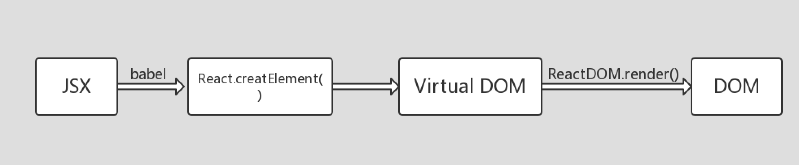

## 实现React.createElement, ReactDOM.render方法

### 写在前面...

写代码之前，我们先理清React的渲染流程: React采用的JSX语法，书写方式和直接写HTML标签类似,但是从JSX到DOM，经历了哪些过程呢? 

刚接触React的时候可能很多同学都有这样的感觉: JSX是什么鬼? 或觉得莫名其妙，或觉得很神奇。用的时候: JSX就JSX吧,老夫拿起来就是一把梭。:joy:

1. JSX通过babel编译成React的createElement方法

