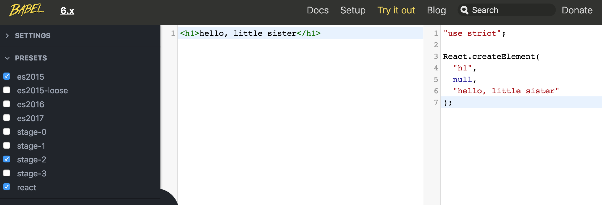

## 实现React.createElement, ReactDOM.render方法

### JSX => DOM方法

用过React的同学可能都有这样的感觉: 

* 刚接触React：JSX是什么鬼 :astonished:莫名其妙，又有点神奇
* 用React: JSX就JSX吧,老夫拿起来就是一把梭:joy:

React采用的JSX语法，书写方式和直接写HTML标签类似,但是从JSX到DOM，经历了哪些过程呢? 本文就带同(da)学(lao)们扒一扒其中的奥妙,实现一个最最最简版的React. 动手写代码之前，我们先理一理React的渲染流程: 

#### 1. babel
我们先把一段JSX代码通过babel编译下看看变成啥样: 打开[http://babeljs.io/](http://babeljs.io/), try it out

JSX通过babel编译成React的createElement方法

